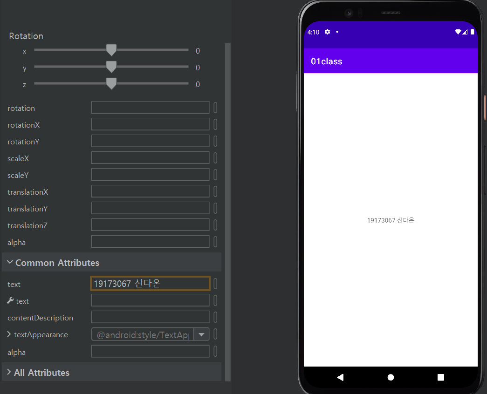
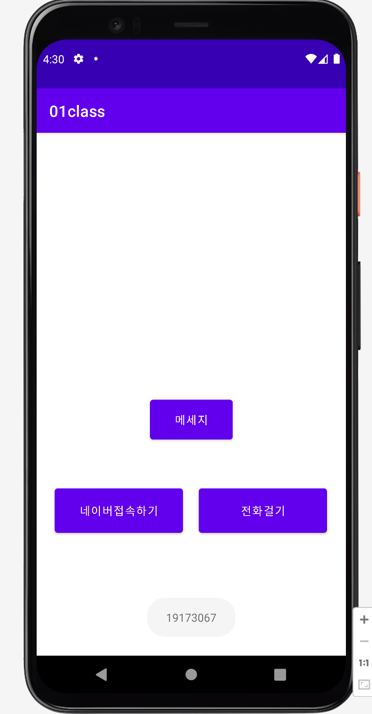
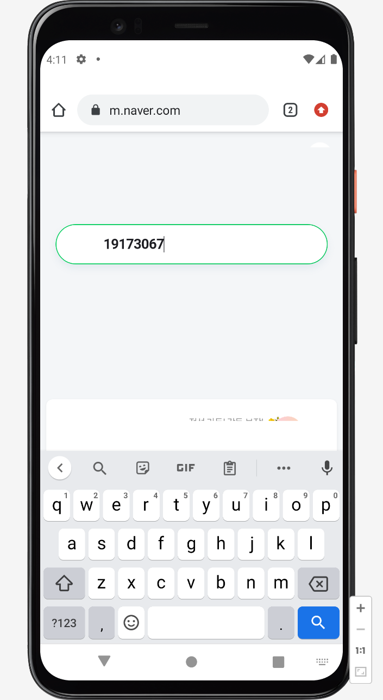
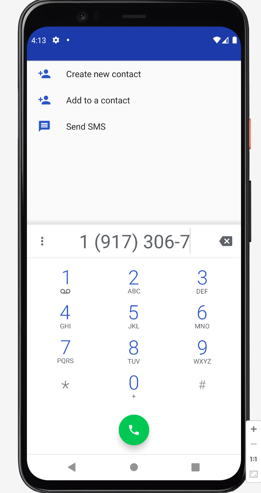
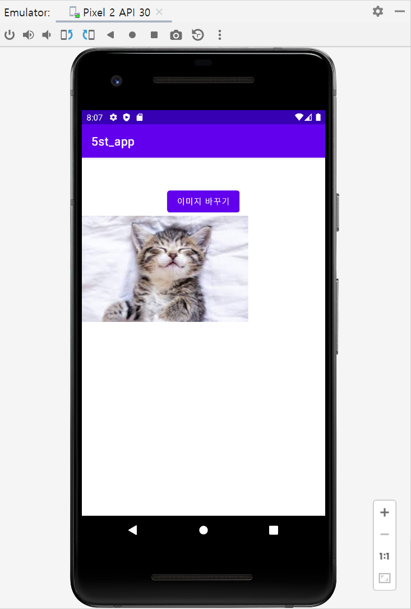
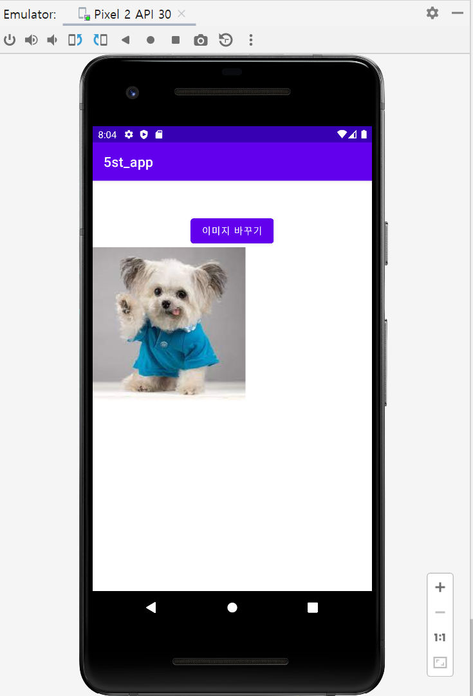
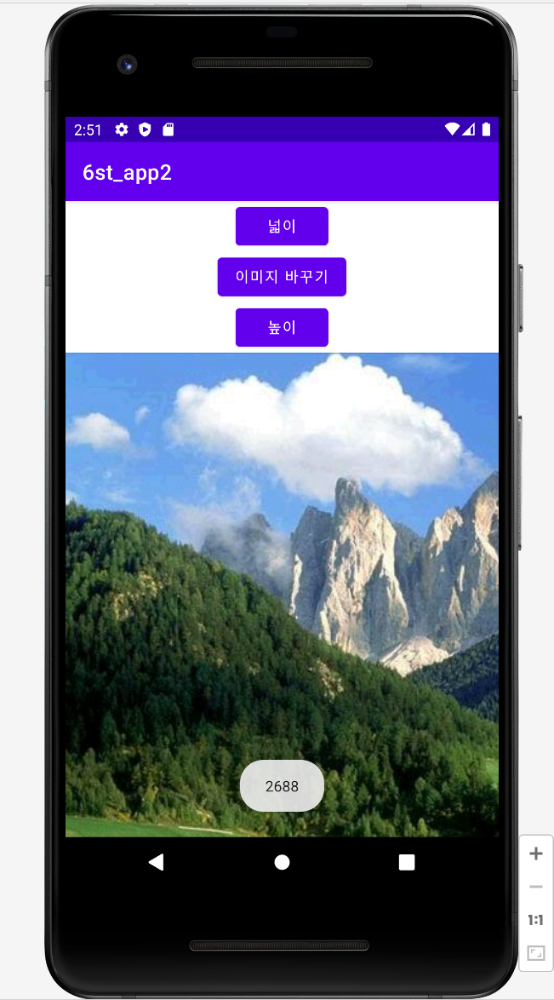
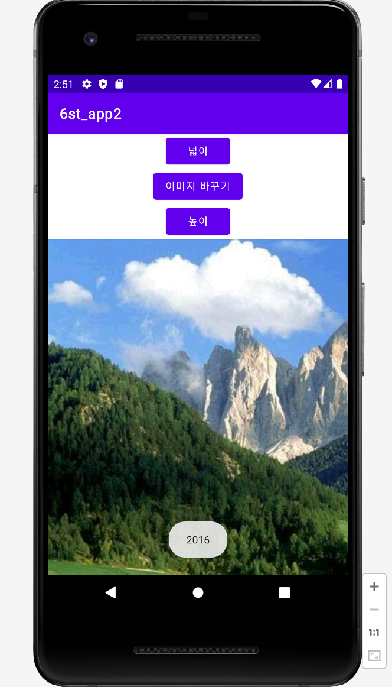

# 2주차 (2022-03-15)
- 안드로이드 스튜디오 설치 & 깃허브 가입 및 저장소 생성
 
</img>

# 3주차 (2022-03-22)
- Toast Message - 네이버 모바일 웹 띄우기 - 전화걸기
 
</img> </img> </img>

# 5주차 (2022-04-05)
- 이미지 바꾸기 버튼으로 뷰의 그림 바꾸기 (각각 pic1, pic2)

</img>
</img>

- 이미지 바꾸기 버튼 소스파일 캡쳐

</img>
</img>

# 6주차 (2022-04-12)
- 사진 넓이, 높이값 Toast Message 띄우기

</img>
</img>
